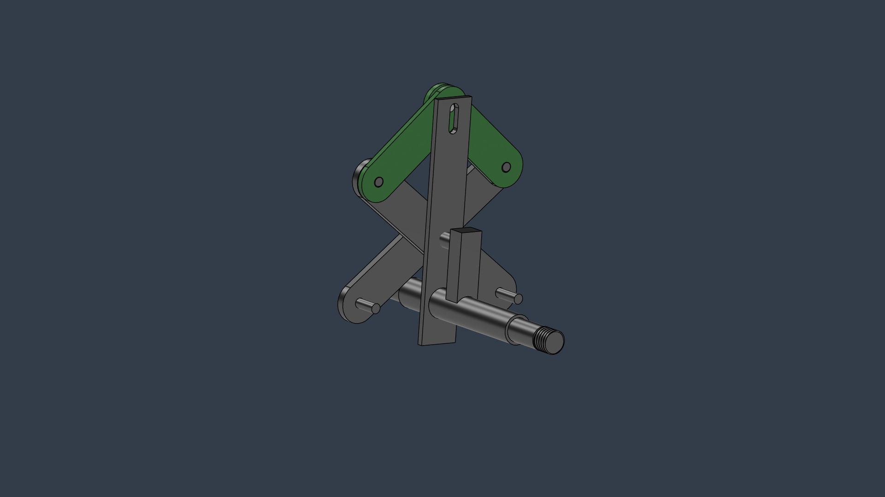
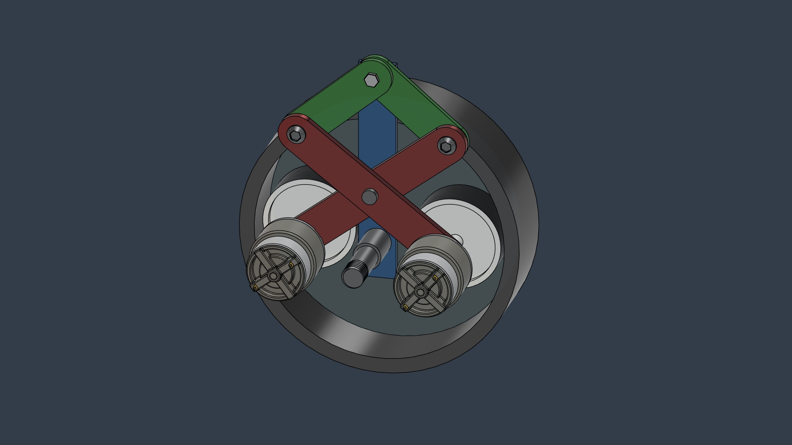
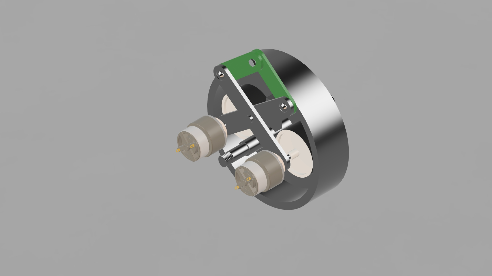

# Regenerative Braking System — Modular Front-Wheel Attachment for Bicycles


> **Bachelor Thesis Project** · Silver Oak College of Engineering & Technology · Gujarat Technological University · 2020–21

---

## Overview

This project proposes a regenerative braking system designed as a modular attachment for conventional bicycle front wheels. The core concept replaces the traditional friction brake shoe with a dynamo-contact mechanism — when the rider applies the brake, two small dynamos are pressed against the inner wall of a rotating drum housing, simultaneously providing braking force and generating electrical energy. The recovered energy is stored in a battery for auxiliary use such as mobile charging or lighting.

The project was developed as a final year Bachelor thesis during the COVID-19 pandemic (2020–21). Due to campus and workshop access restrictions, the project was completed as a full CAD design and theoretical concept study using Fusion 360.

**Tools:** Fusion 360 · Mechanical Design · Kinematic Mechanism Design

---

## Problem Statement

In conventional friction braking, all kinetic energy is lost as heat through contact between brake pads and the rim or disc. For bicycles used in daily commuting or long-distance travel, this represents a continuous and unrecovered energy loss. This project explores whether that braking energy can be partially recovered and stored using a compact, retrofittable hub-mounted mechanism — without modifying the existing bicycle frame or drivetrain.

---

## Design Concept & Working Principle

The system is built around a **drum-brake-inspired mechanism** where the brake shoes are replaced by dynamos.


### How it works — step by step:

1. **At rest / riding:** The drum housing rotates freely with the wheel. The dynamos are held away from the housing wall — no contact, no drag.
2. **Brake applied:** The rider pulls the brake lever → brake cable pulls the V-shaped green link upward → the scissor mechanism pushes both dynamo arms outward simultaneously.
3. **Contact & generation:** The dynamo rollers press against the inner surface of the rotating drum housing → friction drives the dynamo shafts → electrical energy is generated.
4. **Braking:** The same contact friction that drives the dynamos also decelerates the wheel — braking and energy generation happen in the same event.
5. **Storage:** Generated electricity is stored in a 12V lead-acid battery mounted on the frame, available for auxiliary use.



> The green V-shaped link is a scissor/pantograph mechanism — when pulled by the brake cable, the geometry of the pivot points forces both dynamo arms outward symmetrically and simultaneously, ensuring balanced contact force and equal engagement on both sides of the housing wall.





---

## Key Design Parameters

| Parameter | Value |
|---|---|
| Tyre circumference | 1170 mm |
| Housing (drum) circumference | 470 mm |
| Dynamo roller circumference | 160 mm |
| Gear ratio | 1 tyre rev = ~3 dynamo revs |
| Number of dynamos | 2 |

The 3:1 speed step-up from wheel to dynamo shaft is an inherent result of the circumference ratio — meaning the dynamos spin at approximately three times the wheel's rotational speed, improving generation efficiency without any additional gearing.

---

## Bill of Materials

| Component | Material | Function |
|---|---|---|
| Housing / Drum | Steel | Rigidly attached to rim — rotates with the wheel, acts as the contact surface for dynamos |
| Brake Link | Steel | Lever arm — transfers brake cable pull into radial dynamo engagement |
| Dynamo (×2) | — | Converts rotational contact energy into electrical energy |
| Central Rod | Steel | Structural axis — supports link and dynamo sub-assembly |
| Axle | Steel | Mounts the full assembly to the front fork dropouts |
| Battery | Lead-Acid 12V | Stores generated electrical energy for auxiliary use |

---

## CAD Files

Two design configurations are provided as STEP files, compatible with all major CAD software. Both represent full wheel assembly variants explored during the design process.

```
/cad
  ├── wheel_assembly_internal_hub.STEP
  └── wheel_assembly_external_attachment.STEP
```

**Version 1 — Internal Hub (`wheel_assembly_internal_hub.STEP`)**
The drum housing replaces the standard wheel hub. The entire RBS mechanism is integrated within the wheel alongside the spoke structure. More compact as a complete system, but requires a custom-built wheel rather than retrofitting onto an existing one.

**Version 2 — External Attachment (`wheel_assembly_external_attachment.STEP`)**
The drum housing mounts externally onto a standard hub via the axle. The RBS mechanism attaches to the side face of the wheel. Fully retrofittable onto a conventional bicycle without modifying the wheel structure or frame.

---

## Repository Structure

```
/renders          → All CAD render images used in this README
/cad              → STEP files for both design configurations
README.md
```

---

## Project Context

| | |
|---|---|
| **Type** | Bachelor Thesis (Final Year Project) |
| **Institution** | Silver Oak College of Engineering & Technology |
| **University** | Gujarat Technological University, Ahmedabad, India |
| **Period** | December 2020 – April 2021 |
| **Team Size** | 4 members |
| **Software** | Fusion 360 |
| **Note** | Project completed as CAD and theoretical study due to COVID-19 campus restrictions |

---

## Relevance

This project demonstrates:
- Kinematic mechanism design (link-lever-contact system)
- Design for retrofittability — no frame modification required
- Energy system thinking — braking, generation, and storage in one integrated concept
- Fusion 360 assembly modelling with multiple moving components
- Application of sustainable engineering principles to low-cost everyday transport
